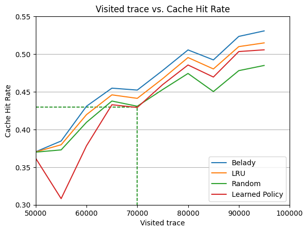

This project is inspired by [PARROT](https://github.com/google-research/google-research/tree/master/cache_replacement) by Google Research, simulating and evaluating the model on the Wikipedia CDN trace.

## Dataset
The simulation uses The Wikipedia CDN trace dataset in 2018 and 2019 provided by [Evan et al](https://www.usenix.org/conference/nsdi20/presentation/song), which is collected with the support of the Wikimedia Foundation and is publicly released on [sunnyszy/lrb](https://github.com/sunnyszy/lrb).

## ML architecture
The model architecture is based on the attention mechanism.


## Training model

Train the model to capture access patterns from the given dataset, where the model checkpoint file will be saved in every `training.save_frequency` learning step.

```bash
python main.py
```

### Configuration

You can configure the model hyperparameters and the training process, including learning rates or batch size. `configuration.py` includes the below fields.

| Field                    | Description                                                                                                                  |
|--------------------------|------------------------------------------------------------------------------------------------------------------------------|
| `experiment.base_dir`    | The base directory where experiment-related files and results will be saved.                                                |
| `experiment.name`        | A name or identifier for the experiment.                                                                                    |
| `dataset.filepath`       | The filepath to the dataset used for training and evaluation.                                                               |
| `dataset.window_size`    | The size of the sliding window used to extract subsequences from the dataset.                                                |
| `dataset.capacity`       | The maximum capacity of the cache used in the simulation.                                                                  |
| `dataset.access_history_len` | The length of the access history used in the cache policy model.                                                        |
| `dataset.scorer_type`    | The type of scorer used in the cache policy model. (`belady`, `lru`, `learned`, `random`, `mixture`)                                                                        |
| `model.obj_id_embedder.type` | The type of object ID embedder used in the cache policy model. (`dynamic_vocab`, `logarithmic`, `positional`)                                                         |
| `model.obj_id_embedder.max_vocab_size` | The maximum vocabulary size for the object ID embedder.                                                       |
| `model.obj_id_embedder.embedding_dim` | The dimension of embeddings for object IDs.                                                               |
| `model.obj_size_embedder.type` | The type of object size embedder used in the cache policy model. (`dynamic_vocab`, `logarithmic`, `positional`)                                                     |
| `model.obj_size_embedder.embedding_dim` | The dimension of embeddings for object sizes.                                                       |
| `model.obj_size_embedder.max_size` | The maximum object size considered in the model.                                                                   |
| `model.obj_size_embedder.max_vocab_size` | The maximum vocabulary size for the object size embedder.                                                       |
| `model.cache_lines_embedder` | The type of cache lines embedder used in the cache policy model.                                                        |
| `model.positional_embedder.type` | The type of positional embedder used in the cache policy model.                                                         |
| `model.positional_embedder.embedding_dim` | The dimension of embeddings for positional information.                                                       |
| `model.lstm_hidden_size` | The size of the LSTM hidden state in the cache policy model.                                                               |
| `model.max_attention_history` | The maximum number of attention history steps considered in the model.                                                 |
| `dagger_schedule.type`   | The type of schedule used for DAgger updates during training. (`linear`, `constant`)                                                            |
| `dagger_schedule.initial` | The initial DAgger rate.                                                                                                     |
| `dagger_schedule.final`   | The final DAgger rate.                                                                                                       |
| `dagger_schedule.num_steps` | The total number of training steps.                                                                                        |
| `dagger_schedule.update_frequency` | The frequency of DAgger updates during training.                                                                |
| `training.learning_rate` | The learning rate used for training the cache policy model.                                                               |
| `training.batch_size`    | The batch size used in training.                                                                                            |
| `training.sequence_length` | The length of training sequences used in training.                                                                        |
| `training.collection_multiplier` | The multiplier used to determine the number of training sequences collected.                                        |
| `training.total_steps`   | The total number of training steps.                                                                                        |
| `training.save_frequency` | The frequency at which model checkpoints are saved.                                                                     |
| `training.evaluation_frequency` | The frequency at which model evaluation is performed.                                                             |
| `training.evaluation_size` | The size of the evaluation dataset.                                                                                      |
| `training.log_loss_frequency` | The frequency at which training loss is logged.                                                                      |
| `training.checkpoint_dir` | The directory where model checkpoints are saved.                                                                      |

## Evaluation

Load the trained model from checkpoint files, and evaluate cache hit rates on the validation dataset.

```bash
python evaluate.py
```



## External Code and Licenses

This project includes code from the [Google Research](https://github.com/google-research/google-research/tree/master) project, which is provided under the Apache License 2.0. Any modifications made to the original code are documented in the respective files.

- Original Code Repository: [google-research/cache_replacement](https://github.com/google-research/google-research/tree/master/cache_replacement)
- License: [Apache License 2.0](http://www.apache.org/licenses/LICENSE-2.0)
